# Ant Air user guide

A tour of every page, using the fictional demo data that
`scripts/seed_demo_data.py` loads (traveller "Sam Rivers", 42 flights from a
London home base). Screenshots are the light theme; the dark theme has the
same layout.

Every page shares the top bar: **Dashboard**, then dropdowns for **Views**
(timeline, achievements, insights), **Data** (flights, trips, aircraft),
**Import** (inbox, CSV), **Audits** and **Admin**. The icon buttons on the
right add a flight, scan a registration from a photo, refresh today's flights
from FlightAware, and switch theme. The search box under the bar searches
flights and aircraft; press `/` to focus it from anywhere, and add
`?theme=light` or `?theme=dark` to any URL to force a theme.

---

## Dashboard

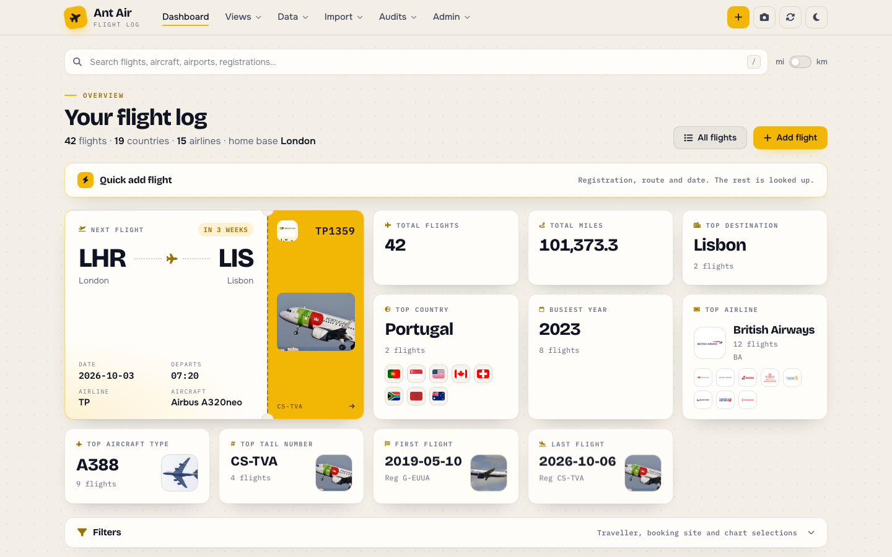

The dashboard is your log at a glance.

- **Next flight** is drawn as a boarding pass: route, date, departure time,
  airline, aircraft, and a countdown. Click it for the full record and the
  aircraft's details and photo.
- **Stat cards** cover total flights and distance, top destination, country
  (with a row of flags), busiest year, top airline (with runners-up), top
  aircraft type and tail number, and your first and last flights. Cards with a
  photo open a lightbox.
- The **mi / km** switch in the toolbar changes every distance on the page.
- **Quick add flight** opens an inline form: enter a registration, route and
  date and the rest is looked up.

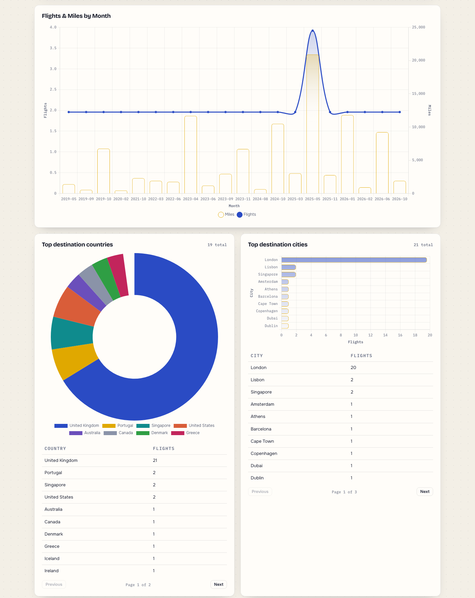

Below the cards: flights and distance by month, then paired chart-and-table
panels for countries, cities, airlines, aircraft types, distance per type,
tail numbers, routes, flights and distance per year, and CO₂ per year.
**Click any table row to filter the whole dashboard** by that value; active
filters appear as chips in the Filters panel, which also filters by
traveller and booking site. Everything updates client-side.

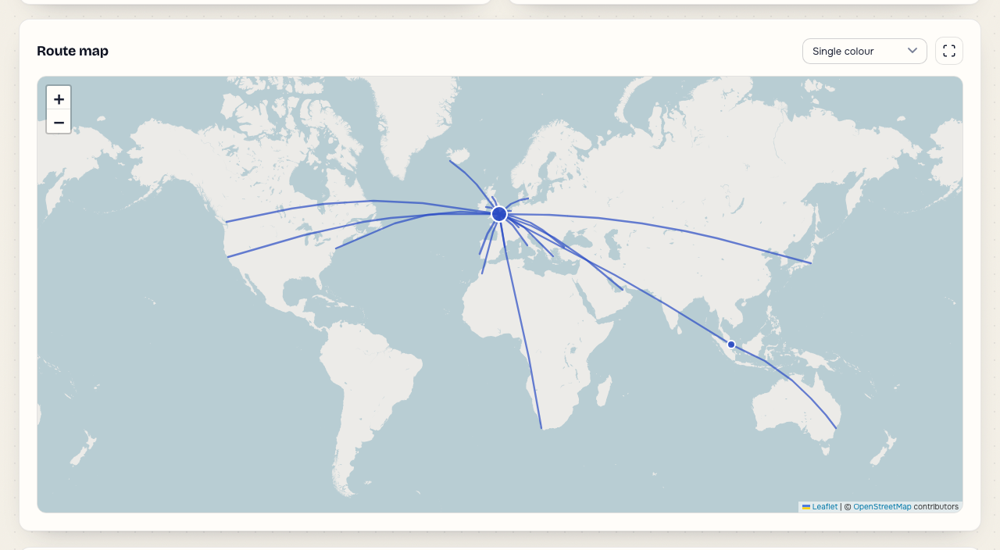

The route map draws great-circle arcs for every flight with coordinates.
Colour them by airline, year, direction or aircraft class, click an arc for
the flights on it, and use the corner button for fullscreen.

---

## Flights

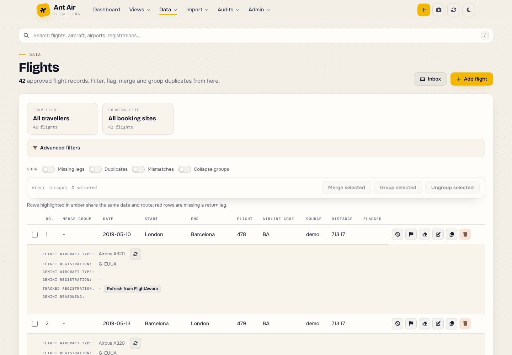

The full list of approved flights. Each row shows the essentials; the panel
beneath it shows what the app knows about the aircraft from each source
(your record, Gemini, tracked history) and lets you refresh from FlightAware
or apply one source's value to the whole group.

- **Advanced filters** narrow the table by aircraft, traveller, airline,
  source, airport, country, city, flight number or confirmation code.
- The **Show** switches highlight flights missing a return leg, rows that
  look like duplicates, and mismatches between sources, and collapse
  duplicate groups to a single row.
- **Merge records** lets you select rows and merge them into one, group them
  (keeping every record but reporting the group once everywhere), or ungroup.
- Row actions: exclude from statistics, flag for follow-up, clear the
  registration, edit, duplicate, delete.

### Adding and editing a flight

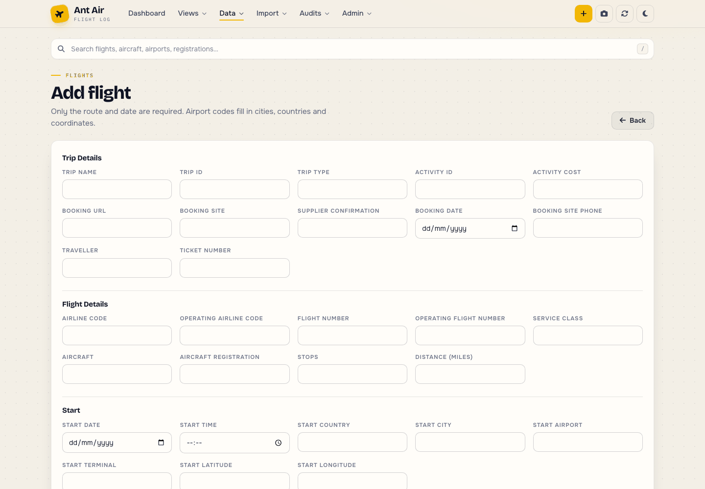

Only the route and date are required. Typing an airport code fills in the
city, country and coordinates; distance and direction are computed. The same
form edits an existing flight, and a quick-edit modal on the dashboard
covers the common fields without leaving the page.

---

## Aircraft

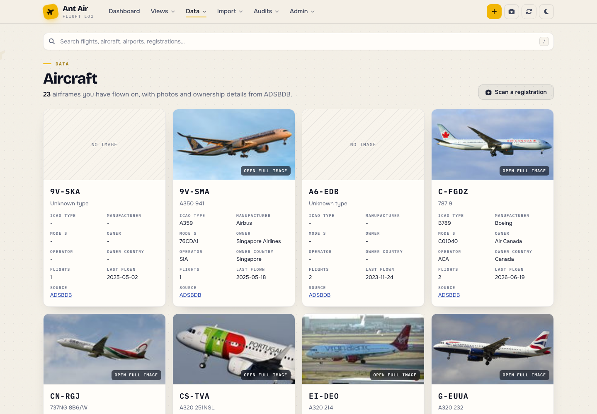

Every registration you have flown on becomes a card with the type, ICAO
code, manufacturer, Mode S code, owner and operator from ADSBDB, plus the
photo when one exists. Clicking a photo opens it full size. **Scan a
registration** takes or uploads a photo, reads the registration with Gemini,
and jumps to the lookup. Searching for a registration anywhere in the app
opens the same lookup modal with your flights on that airframe and its
tracked history.

---

## Trips and timeline

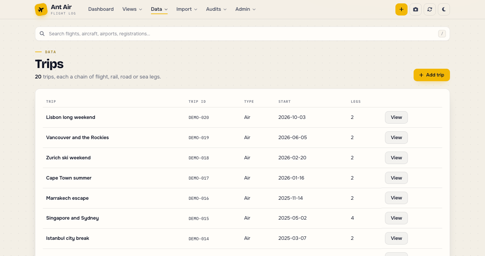

A trip is an ordered set of legs (flight, rail, road, sea, other), each
optionally linked to a flight record. Dates can be as vague as a year.

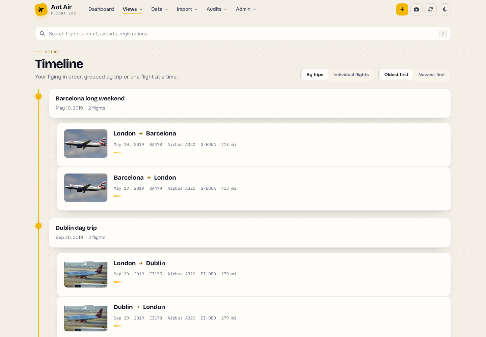

The timeline lists everything chronologically, grouped by trip or one flight
at a time, oldest or newest first, with the aircraft photo and a bar showing
the flight's length relative to your longest.

---

## Achievements

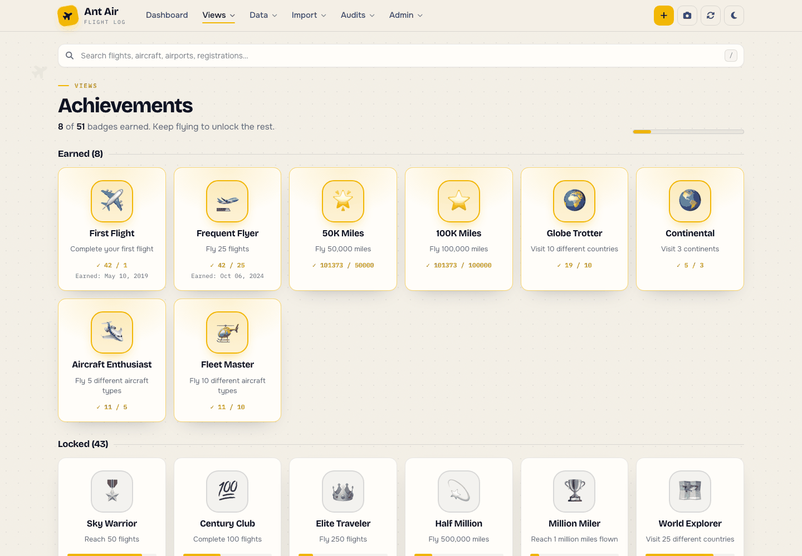

Badges are earned for milestones (flights, distance), geography (countries,
continents), equipment (types, registrations, rare aircraft), time (red-eyes,
flights in a year) and loyalty. Locked badges show progress. Badges are
editable under **Admin → Manage badges**, and `scripts/seed_badges.py`
installs the standard set.

---

## AI insights

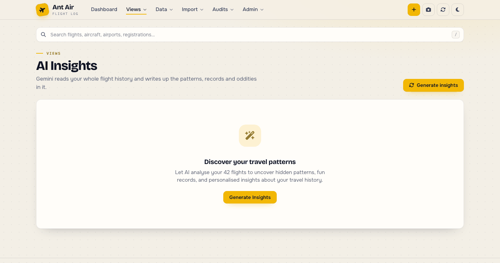

With a Gemini key configured, **Generate insights** sends an anonymised
summary of your history to the model and renders what comes back: a travel
personality, geographic and aircraft observations, records, fun comparisons
and predictions. Results are cached until your flight count or distance
changes.

---

## Imports and the inbox

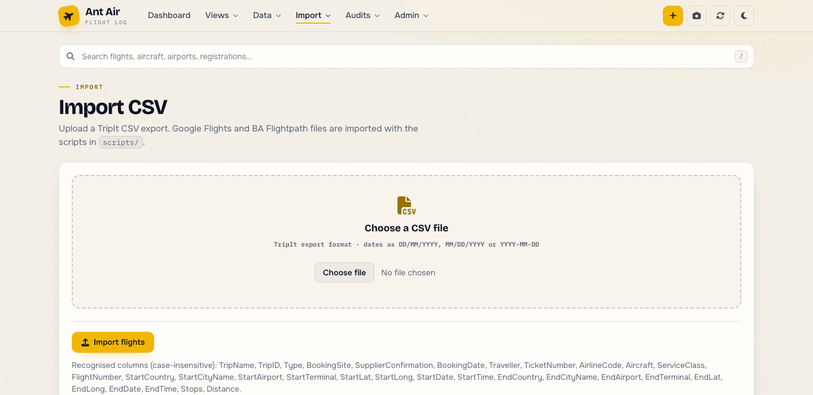

**Import → Import CSV** accepts a TripIt export. Google Flights and BA
Flightpath exports, TripIt HAR captures and boarding-pass photos are imported
with the scripts in `scripts/` (see the README). Fictional examples of each
CSV layout live in `import/samples/`.

Flights created through the webhook or boarding-pass scans arrive in the
**Inbox** as drafts, where you approve, edit or delete them before they count.

---

## Audits

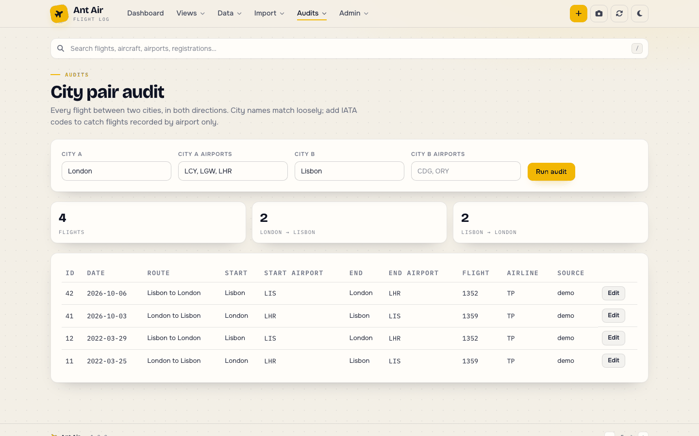

The Audits menu holds the tools that keep the log honest:

- **Duplicates** scores every pair of flights on route, flight number, trip,
  confirmation and ticket numbers, then lets you confirm groups or ignore
  false positives. **Exact match** is the strict version.
- **Missing data** lists flights without an airline code, aircraft type,
  registration or airport codes so you can fill them in.
- **Missing legs** finds outbound flights from your home base (`HOME_CITY`)
  with no return within the configured window.
- **City pair** shows every flight between two cities in both directions;
  City A defaults to your home base.
- **Gemini** audits review AI-guessed aircraft types and codeshare lookups.

---

## Admin

**Utilities** runs the maintenance and backfill scripts from `scripts/`
inside the app with live output, and **Manage badges** edits the achievement
catalogue.

---

## On a phone

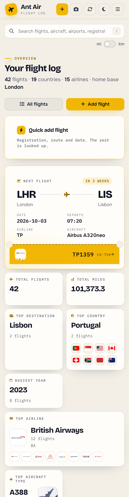

The layout collapses to a single column with a drawer menu; the boarding
pass, charts, tables and forms all work at phone width.

---

## Beyond the browser

- **MCP server**: `python -m app.mcp_server` exposes the same data as tools
  for Claude Code, Claude Desktop or any MCP client (see the README).
- **REST + sync API**: `/api/v1/...`, used by the SwiftUI companion app in
  `ios/`.
- **Webhook**: `POST /webhooks/n8n` creates draft flights from automation
  tools.
